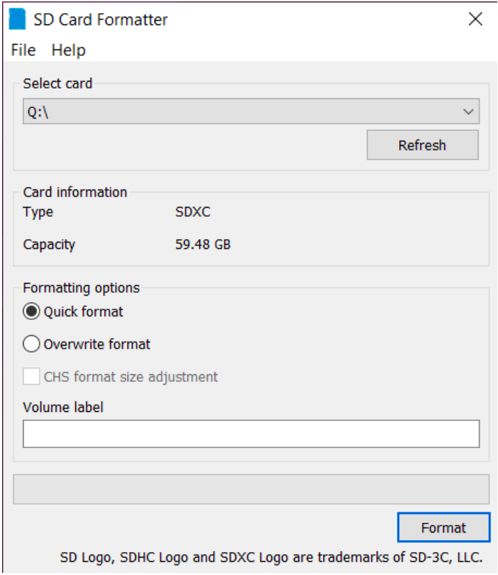
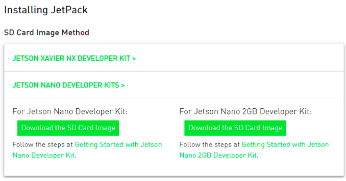
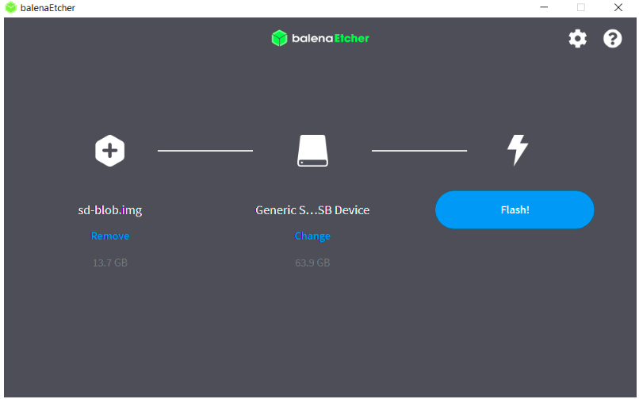
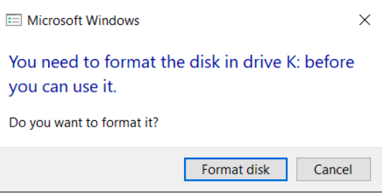
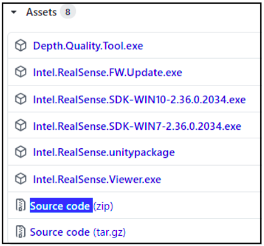
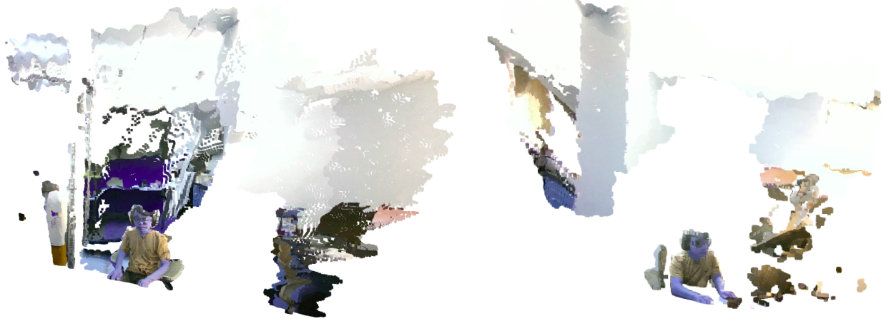
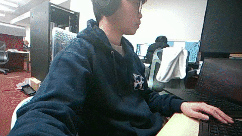
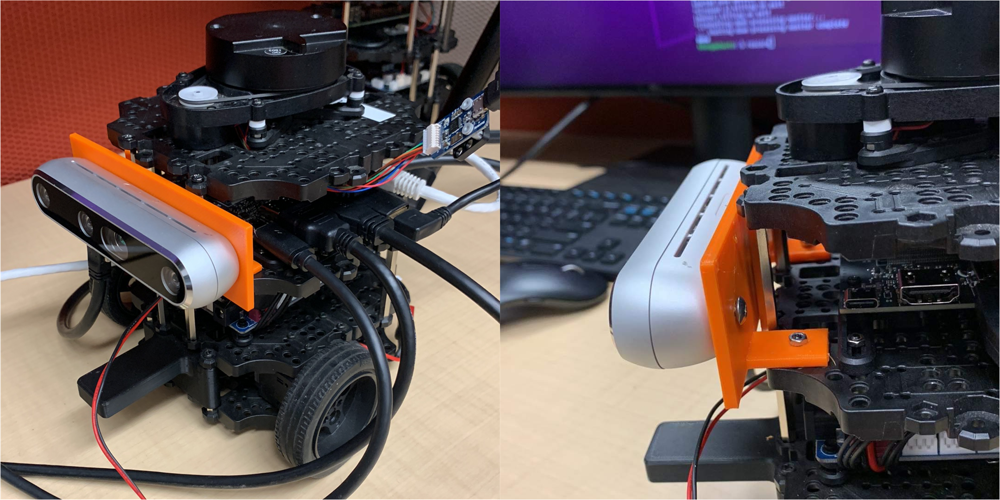

# 🐢 Tutorial for Object Detection using the TurtleBot3 Project @ RVL
This is the tutorial for my TurtleBot project at the UTA Robotic Vision Lab (RVL). The tutorial breaks down into several parts, step-by-step, to reproduce the outcome:
  - [Boot the NVIDIA Jetson Nano 2GB](#boot-the-NVIDIA-Jetson-Nano-2GB)
  - [Install necessary packages on the NVIDIA Jetson Nano 2GB](#install-necessary-packages-on-the-NVIDIA-Jetson-Nano-2GB)
  - [Build *pyrealsense2* library from source on the NVIDIA Jetson Nano 2GB](#build-pyrealsense2-library-from-source-on-the-NVIDIA-Jetson-Nano-2GB)
  - [Launch Intel Realsense Camera D455 on the NVIDIA Jetson Nano 2GB](#launch-Intel-Realsense-Camera-D455-on-the-NVIDIA-Jetson-Nano-2GB)
  - [Install *torch* and *torchvision* for the NVIDIA Jetson Nano 2GB](#install-torch-and-torchvision-for-the-NVIDIA-Jetson-Nano-2GB)
  - [Build object detection module from source on the NVIDIA Jetson Nano 2GB](#build-object-detection-module-from-source-on-the-NVIDIA-Jetson-Nano-2GB)
  - [Install ROS Melodic Distribution for the NVIDIA Jetson Nano 2GB](#install-ROS-Melodic-Distribution-for-the-NVIDIA-Jetson-Nano-2GB)
  - [Configure the NVIDIA Jetson Nano 2GB for the TurtleBot3](#configure-the-NVIDIA-Jetson-Nano-2GB-for-the-TurtleBot3)
  - [Mount Intel Realsense Camera D455 on to the TurtleBot3](#mount-Intel-Realsense-Camera-D455-on-to-the-TurtleBot3)

## Boot the NVIDIA Jetson Nano 2GB.
 1. Download the [SD card formatter software for Windows](https://www.sdcard.org/downloads/formatter/sd-memory-card-formatter-for-windows-download/).
 2. Insert the microSD card in the card reader, launch SD card formatter software, choose *Quick Format* option, and click *Format*. 
 <p align="center">
 <br/>
 <i>Format microSD Card</i>
 </p>
 
 3. Download [JetPack SDK 4.6 OS image](https://developer.nvidia.com/embedded/jetpack-sdk-46) (JetPack SDK SDK 4.6.1 will give problem when booting), and click the one for Jetson Nano 2GB.
 <p align="center">
 <br/>
 <i>Download JetPack SDK 4.6 OS Image</i>
 </p>
 
 4. Download [balena Etcher for Windows](https://www.balena.io/etcher/).
 5. Select the **.zip file for OS image** in your Download directory, select the *SD card as target*, and click *Flash*. The process should take about 20 minutes.
 <p align="center">
 <br/>
 <i>Flash microSD Card</i>
 </p>
 
 5. When done formatting, Windows would ask you to read the microSD card. Click *Cancel*.
 <p align="center">
 <br/>
 <i>Window asking to Re-read microSD Card</i>
 </p>
 
 6. Insert SD card into Jetson Nano and boot, set up your username and password, then click every option that is recommended.

## Install necessary packages on the NVIDIA Jetson Nano 2GB
Install pip:
```python
sudo apt-get install python-pip python3-pip
```
Install nano:
```python
sudo apt install nano
```
Install sympy:
```python
python3 -m pip install sympy
```
Install tqdm:
```python
python3 -m pip install tqdm
```
Install libcurl:
```python
sudo apt install curl
```
Install jtop:
```python
sudo -H pip install -U jetson-stats
```
Install openssl:
```python
sudo apt-get install libssl-dev
```

## Build *pyrealsense2* library from source on the NVIDIA Jetson Nano 2GB.
Since *pyrealsense2* does not support ARM architecture on devices such as Jetson Nano, we have to build it from source.

1. Download source code from of [librealsense](https://github.com/IntelRealSense/librealsense/releases/). Click on *Source code*.
 <p align="center">
 <br/>
 <i>Source Code for pyrealsense2 Library</i>
 </p>

2. Extract the folder and move it to the root directory.
3. Check python3 version:
```python
which python
```
and it returns:
```python
Python 3.6.9
```
Check the location of Python binary file:
```python
ls /usr/bin/ | grep python3.6
```
and it returns:
```python
python3.6
```

4. Execute the following commands:
```python
# Go to the extracted source code file
cd librealsense/
# Make and go to the "build" directory
mkdir build && cd build/
# CMake source code and bind to the binary file "/usr/bin/python3.6"
cmake ../ -DFORCE_RSUSB_BACKEND=ON -DBUILD_PYTHON_BINDINGS:bool=true -DPYTHON_EXECUTABLE=/usr/bin/python3.6
# Make and install
make -j4
sudo make install
```

5. Modify the *.bashrc* file.
```python
# Edit the .bashrc file
nano ~/.bashrc
# Set the environment path and python path
export PATH=$PATH:~/.local/bin
export PYTHONPATH=$PYTHONPATH:/usr/local/lib
export PYTHONPATH=$PYTHONPATH:/usr/local/lib/python3.6/pyrealsense2
# Source the .bashrc file again
source ~/.bashrc
```

6. Test to see if *pyrealsense2* is installed.
```python
python3
import pyrealsense2
print(pyrealsense2.__version__)
```
and it should return
```python
2.51.1
```

## Launch Intel Realsense Camera D455 on the NVIDIA Jetson Nano 2GB.
The source code for the demo can be found in the [test_camera](test_camera) folder. Some of the point cloud samples can be found in [pcd_data](test_camera/pcd_data) folder, and the retreival RGB video and depth data video corresponding to the RGB video can be found in [vid_data](test_camera/vid_data).

The source code should contain:
1. [rgb_depth_videos.py](test_camera/rgb_depth_videos.py) to view and collect RGB image data and depth color map simultaneously. When running this file, something looks like this should pop-up.
 <p align="center">
 <br/>
 <i>RGB and Thermal Depth Images Simultaneously Acquisition</i>
 </p>
 
2. [get_pcd.py](test_camera/get_pcd.py) to get point cloud data. The collected data should be saved in [pcd_data](test_camera/pcd_data) folder.
3. [view_pcd.py](test_camera/view_pcd.py) to view point cloud data. When running this file, it should show each .ply file separately. These are some of the samples in the obtained sequence.
 <p align="center">
 <br/>
 <i>Collected Point Cloud Data Samples</i>
 </p>

## Install *torch* and *torchvision* for the NVIDIA Jetson Nano 2GB.
1. Execute following commands to install Pytorch on Nano:
```python
# Install necessary dependencies and packages
sudo apt-get install ninja-build git cmake
sudo apt-get install libjpeg-dev libopenmpi-dev libomp-dev ccache
sudo apt-get install libopenblas-dev libblas-dev libeigen3-dev
sudo pip3 install -U --user wheel mock pillow
sudo -H pip3 install testresources
sudo -H pip3 install setuptools==58.3.0
sudo -H pip3 install scikit-build
# Clone Pytorch source code
git clone -b v1.10.0 --depth=1 --recursive https://github.com/pytorch/pytorch.git
cd pytorch/
# Install Pytorch
sudo python3 -m pip install -r requirements.txt
```

2. Test to see if *torch* is installed.
```python
python3
import torch
print(torch.__version__)
```
and it should return
```python
1.10.0
```

3. Execute following commands to install TorchVision on Nano:
```python
# Install necessary dependencies and packages
sudo apt-get install libjpeg-dev zlib1g-dev libpython3-dev
sudo apt-get install libavcodec-dev libavformat-dev libswscale-dev
sudo pip3 install -U pillow
sudo -H pip3 install gdown
# Clone TorchVision source code
gdown https://drive.google.com/uc?id=1C7y6VSIBkmL2RQnVy8xF9cAnrrpJiJ-K
# Install TorchVision
sudo -H pip3 install torchvision-0.11.0a0+fa347eb-cp36-cp36m-linux_aarch64.whl && rm torchvision-0.11.0a0+fa347eb-cp36-cp36m-linux_aarch64.whl
```

4. Test to see if *torchvision* is installed.
```python
python3
import torchvision
print(torchvision.__version__)
```
and it should return
```python
0.11.0
```

## Build object detection module from source on the NVIDIA Jetson Nano 2GB.
Execute following commands to install object detection module on Nano (this process should take about 30 minutes):
```python
# Install necessary dependency
sudo apt-get install git cmake libpython3-dev python3-numpy
# Clone Jetson Inference source code
git clone --recursive https://github.com/dusty-nv/jetson-inference
cd jetson-inference/
# Make and go to the "build" directory
mkdir build && cd build/
# CMake source cod
cmake ../
# Make, install, and link all configs together
make -j4
sudo make install
sudo ldconfig
```

3. Customize the *detectnet.py* file as it is in this [version](object_detection/detectnet.py)
In the customized version, some unecessary stuffs are removed. The input image size are resized to 480 pixels of width and 320 pixels of height. However, the detection rate (~10 fps) is still not very at a satisfaction level as it was tested on the NDIVIA Jetson Nano 4GB (~20 fps). You can copy the modified version above and test on your Nano.

## Run detection on Intel Realsense D455 camera
1. Check camera path of D455 Camera:
```python
v4l2-ctl –list-devices
```
and it returns (one of these source device should display RGB image frames)
```python
dev/video0
dev/video1
dev/video2  # for me, the right one is this one
```

2. After modifying the *detectnet.py* file, we can go ahead running the detection.
```python
cd ~/jetson-inference/build/aarch64/bin/
./detectnet.py #(or ./detectnet.py demo_mobilenetv2.mp4) --> this saves your detection video into a .mp4 file
```

When running the program, you showld see something like this. The file will be saved in the same directory, and it should be same as my demo. My demo video can be found at [demo_mobilenetv2.mp4](object_detection/demo_mobilenetv2.mp4). The gif is partitioned from the demo video, the model detects me (as person), keyboard, and my laptop.
 <p align="center">
 <br/>
 <i>MobileNet SSD v2 Detection on NDIVIA Jetson Nano 2GB</i>
 </p>
 
## Install ROS Melodic Distribution for the NVIDIA Jetson Nano 2GB.
Since our NVIDIA Jetson Nano 2GB operates on Ubuntu 18.04, we need to install the appropriate ROS distribution, which is [ROS Melodic](http://wiki.ros.org/melodic).
1. Set the NVIDIA Jetson Nano 2GB to accept packages from [packages.ros.org](http://packages.ros.org/):
```python
sudo sh -c 'echo "deb http://packages.ros.org/ros/ubuntu $(lsb_release -sc) main" > /etc/apt/sources.list.d/ros-latest.list'
```

2. Set up secure keys to accept to-be-downoaded packages:
```python
sudo apt update
sudo apt-key adv --keyserver 'hkp://keyserver.ubuntu.com:80' --recv-key C1CF6E31E6BADE8868B172B4F42ED6FBAB17C654
```

3. Install ROS Melodic:
```python
sudo apt-get update
sudo apt install ros-melodic-desktop-full
```
and just go ahead accepting all the installation requirements.

4. After completing installation process, we also have to set up the environment for ROS:
```python
echo "source /opt/ros/melodic/setup.bash" >> ~/.bashrc
source ~/.bashrc
```

5. Finally, we also need to initialize *rosdep*, which is a tool that is required before we can use ROS properly:
```python
sudo apt install python-rosdep
sudo apt install python-rosdep
rosdep update
```

6. After all above installation procedure, we can verify the installed ROS version by typing:
```python
rosversion -d
```
and it should pop up as:
```python
melodic
```

## Configure the NVIDIA Jetson Nano 2GB for the TurtleBot3.
1. After connecting the USB ports (of the OpenCR board) to the NVIDIA Jetson Nano 2GB, we need to grant permission of the port by executing the following command:
 ```python
sudo chmod a+rw /dev/ttyACM0
```
2. Next, we have to install all necessary TurtleBot3 packages as well as slam_gmapping package:
```python
# Install TurtleBot3 packages for ROS Melodic
sudo apt-get install ros-melodic-turtlebot3-*
# Install slam_gmapping package for ROS Melodic
sudo apt-get install ros-melodic-openslam-gmapping
```
We can verify the installed packages by typing:
```python
rospack list-names | grep turtlebot3
```
and it should return:
```python
turtlebot3_bringup
turtlebot3_description
turtlebot3_example
turtlebot3_msgs
turtlebot3_navigation
turtlebot3_slam
turtlebot3_teleop
```
```python
rospack list-names | grep gmapping
```
and it should return:
```python
openslam_gmapping
```
                                         
3. Hence, we have to export the IP addresses (of host computer and TurtleBot), TurtleBot model, and the LiDAR model in the .bash file **on the TurtleBot**. The necessary lines are provided below:
```python
# Edit the .bashrc file
nano ~/.bashrc
# Set IP addresses and hardware models
export ROS_MASTER_URI=http://{IP_ADDRESS_OF_HOST_PC}:11311
export ROS_HOSTNAME={IP_ADDRESS_OF_JETSON_NANO}
export TURTLEBOT3_MODEL=burger
export LDS_MODEL=LDS-01
# Source the .bashrc file again
source ~/.bashrc
```
and configure the .bash file **on the host PC** as well. The necessary lines are provided below:
```python
# Edit the .bashrc file
nano ~/.bashrc
# Set IP addresses and hardware models
export ROS_MASTER_URI=http://{IP_ADDRESS_OF_HOST_PC}:11311
export ROS_HOSTNAME={IP_ADDRESS_OF_HOST_PC}
export TURTLEBOT3_MODEL=burger
export LDS_MODEL=LDS-01
# Source the .bashrc file again
source ~/.bashrc
```
4. Lastly, we will be able to bring up the robot, run SLAM node, and teleoperation node:
```python
roslaunch turtlebot3_bringup turtlebot3_robot.launch         # bring up
roslaunch turtlebot3_slam turtlebot3_slam.launch             # slam
roslaunch turtlebot3_teleop turtlebot3_teleop_key.launch     # teleoperation
```
## Mount Intel Realsense Camera D455 on to the TurtleBot3.
After installing all the necessary software and configuring the board, we go ahead to mount the camera to the front of the TurtleBot. The [3D design file](https://github.com/robotic-vision-lab/Robotic-Vision-Lab-Demos/blob/master/turtlebot3_demo/3d_design/holder.SLDPRT) and the [STL file](https://github.com/robotic-vision-lab/Robotic-Vision-Lab-Demos/blob/master/turtlebot3_demo/3d_design/holder.STL) are provided in the [3d_design](https://github.com/robotic-vision-lab/Robotic-Vision-Lab-Demos/tree/master/turtlebot3_demo/3d_design) folder. Your mounting result should be something like mine if you use the provided STL file for printing:
 <p align="center">
 <br/>
 <i>Intel Realsense Camera D455 mounted on TurtleBot3</i>
 </p>
